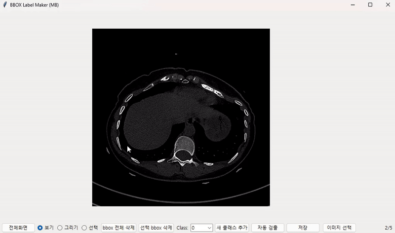

# Private Bounding Box Maker

## Overview
Private Bounding Box Maker is a labeling tool for object detection that supports the YOLO format. Using TkinterDnD, it provides drag-and-drop functionality and an intuitive interface for creating bounding boxes on images efficiently.

## Demo


## Key Features
- Drag and drop image file loading
- Intuitive mouse controls for labeling
  * Smooth zoom with mouse wheel
  * Image panning with middle mouse button
  * Precise bounding box creation and editing
- YOLO format (.txt) label data saving
- Advanced image navigation and manipulation
- Bounding box editing and deletion
- Previous/Next image navigation
- Video frame extraction and labeling support

## Installation
```bash
# Install required packages
pip install tkinterdnd2
pip install Pillow
```

## Usage
1. Launch the Program
```bash
python main.py
```

2. Load Images/Videos
   - Add image/video files or folders via drag and drop
   - Select files or folders from the File menu
   - Automatic frame extraction for video files

3. Create Bounding Boxes
   - Left-click and drag to draw boxes
   - Select class after box creation

4. Edit Bounding Boxes
   - Select and move or resize boxes
   - Delete selected boxes using Delete key

5. Save
   - Automatic saving feature
   - Generates YOLO format .txt files for each image

## Controls and Shortcuts

### Mouse Controls
- `Mouse Wheel` : Zoom in/out around cursor position
- `Middle Mouse Button + Drag` : Pan the image
- `Left Click + Drag` : Create bounding box
- `Left Click` : Select bounding box
- `Left Click + Drag (on box)` : Move bounding box
- `Left Click + Drag (on corner)` : Resize bounding box

### Keyboard Shortcuts
- `→` : Next image/frame
- `←` : Previous image/frame
- `Del` : Delete selected box
- `Ctrl+S` : Manual save

## Output Format
YOLO format text file (.txt)
```
<class> <x_center> <y_center> <width> <height>
```
- All values are normalized by image dimensions (0~1)
- Classes start from integer 0

## System Requirements
- Python 3.6 or higher
- tkinterdnd2
- Pillow

## Features in Detail

### Image Processing
- Support for common image formats (jpg, png, bmp)
- Automatic aspect ratio maintenance
- Real-time image scaling and display

### Video Processing
- Frame extraction from video files
- Support for common video formats (mp4, avi)
- Frame-by-frame navigation

### Annotation Features
- Multiple class support
- Real-time coordinate display
- Automatic label file generation
- Undo/Redo functionality

### User Interface
- Intuitive drag-and-drop interface
- Clear visual feedback
- Status bar with helpful information
- Progress tracking for large datasets

## License
This project is licensed under the MIT License - see the [LICENSE](LICENSE) file for details.

## Contributing
1. Fork the Project
2. Create your Feature Branch (`git checkout -b feature/AmazingFeature`)
3. Commit your Changes (`git commit -m 'Add some AmazingFeature'`)
4. Push to the Branch (`git push origin feature/AmazingFeature`)
5. Open a Pull Request

## Support
If you encounter any issues or have questions, please file an issue on the GitHub repository.
